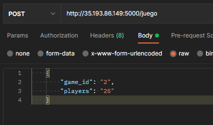

# Practica #2


<table>
    <tr>
        <th>Student</th>
        <th>Id</th>
    </tr>
    <tr>
        <td>Juan Antonio Solares Samayoa</td>
        <td>201800496</td>
    </tr>
</table>

<hr>

# Technical Manual

#### :white_check_mark: Previous requirements

* Google Cloud Platform account
* DockerHub account

<hr>

####  :white_check_mark: Used Architecture


####  :white_check_mark: Server 

##### Used technologies
* Golang
* GRPC


Run container in docker
```
sudo docker run -it  -p 5000:5000  -e HOST=<RABBIT_HOST> clientgrpc_go
```

####  :white_check_mark: Client

Run container in docker 
```
sudo docker run -it -e HOST=34.125.65.198 rabbit_sus_v2 
```

##### Used technologies
* NodeJS
* GRPC

Run container in docker
```
sudo docker run -it  -p 50051:50051  -e RABBIT_HOST=<RABBIT_HOST> servergrpc_node_v3
```


####  :white_check_mark: Rabbitmq consumer

Run container in docker
```
sudo docker run rabbit_sus_v2
```


####  :white_check_mark: Database

The database used for this project is Mongodb due its easy to use and does not consume a lot of CPU / Memory resources.

How to configurate a mongodb instance with docker

```
docker run --name mongodb -d -p 27017:27017 mongo
```

Start instance after shutdown
```
docker start <MONGODB_CONTAINER_ID>
```


####  :white_check_mark: Docker

Login in dockerHub
``` 
docker login 
```

Build images
``` 
cd folder
docker build -t <IMAGE_NAME> .
```


Tag images 
```
docker tag <image_id> <dockerHub_user>/<image_name>
```

Push images to registry
```
docker push <dockerHub_user>/<image_name>
```

Start 

####  :white_check_mark: Kubernetes

* Kubernetes Cluster Creation in GKE (Google Kubernetes Engine)
  
    1. Open Google Cloud Administration Console 

        - Click on the command icon located in the upper right corner
        

    2. Write the following comand

        ```
        gcloud config get-value project
        ```

    3. Select the proyect where we are working
    
        ```
        gcloud config set project <NOMBRE DEL PROYECTO>
        ```

    4.  Select zone

        ```
        gcloud config set compute/zone us-central1-a
        ```

    5. Create Cluster (3 nodes, 22.5 GB Memory )

        ```
        gcloud container clusters create <CLUSTER NAME> --num-nodes=3 --tags=all-in,all-out --machine-type=n1-standard-2 --no-enable-network-policy
        ```

* Connect to cluster 

    ```
    gcloud container clusters get-credentials <CLUSTER_NAME> --zone us-central1-a --project <PROJECT_NAME>
    ```

#### :white_check_mark: Rabbitmq with Kubernetes

<p>With tens of thousands of users, RabbitMQ is one of the most popular open source message brokers. From T-Mobile to Runtastic, RabbitMQ is used worldwide at small startups and large enterprises.

RabbitMQ is lightweight and easy to deploy on premises and in the cloud. It supports multiple messaging protocols. RabbitMQ can be deployed in distributed and federated configurations to meet high-scale, high-availability requirements. 
RabbitMQ is the most widely deployed open source message broker.
With tens of thousands of users, RabbitMQ is one of the most popular open source message brokers. From T-Mobile to Runtastic, RabbitMQ is used worldwide at small startups and large enterprises.

RabbitMQ is lightweight and easy to deploy on premises and in the cloud. It supports multiple messaging protocols. RabbitMQ can be deployed in distributed and federated configurations to meet high-scale, high-availability requirements.

RabbitMQ runs on many operating systems and cloud environments, and provides a wide range of developer tools for most popular languages.
</p>

#### Configuration

1. Create rabbit namespace 
```
kubectl create ns rabbits
```
   * Create The following files
       
       * rabbit-rbac.yaml
       * rabbit-configmap.yaml
       * rabbit-secret.yaml
       * rabbit-statefulset.yaml 

        <a href="#"> Go to files </a>

2. Get storage class

    ```
    kubectl get storageclass
    ```

3. Deployment 


    ```
    mkdir rabbitFiles
    cd rabbitFiles
    kubectl apply -n rabbits -f rabbit-rbac.yaml
    kubectl apply -n rabbits -f rabbit-configmap.yaml
    kubectl apply -n rabbits -f rabbit-secret.yaml
    kubectl apply -n rabbits -f rabbit-statefulset.yaml
    ```

4. Access to the UI
    ```
    kubectl -n rabbits port-forward rabbitmq-0 8080:15672
    ```

    Default Username and password:
    Username: ```guest```
    Password: ```guest```

    <i>Remember that you can create new users in the management dashboard. </i>


#### Usage example

<p>Send a post request to the following url ``` http://35.192.86.149:5000 ```, you can use a Traffic Generator or postman. 
</p>

Body request 

```
game_id: String
players: String
```





####  :white_check_mark: References

<a href="https://github.com/marcel-dempers/docker-development-youtube-series/tree/master/messaging/rabbitmq/kubernetes"> Setting Rabbitmq with Kubernetes (Marcel Dempers Github Repository)</a>

<a href="https://hub.docker.com/repository/docker/solaresjuan98/servergrpc_node_v3">Nodejs server</a>

<a href="https://hub.docker.com/repository/docker/solaresjuan98/clientgrpc_go">Golang client </a>


<a href="https://hub.docker.com/repository/docker/solaresjuan98/rabbit_sus_v2">
Rabbit Subcriber with Golang
</a>

