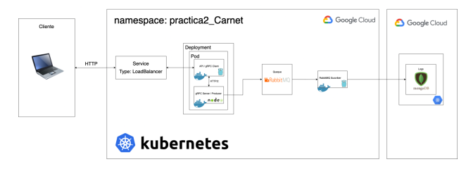

# Practica #2


<table>
    <tr>
        <th>Student</th>
        <th>Id</th>
    </tr>
    <tr>
        <td>Juan Antonio Solares Samayoa</td>
        <td>201800496</td>
    </tr>
</table>

<hr>

# Technical Manual

#### :white_check_mark: Previous requirements

* Google Cloud Platform account
* DockerHub account

<hr>

####  :white_check_mark: Used Architecture




####  :white_check_mark: Server 


####  :white_check_mark: Client


####  :white_check_mark: Database


####  :white_check_mark: Docker


####  :white_check_mark: Kubernetes

* Kubernetes Cluster Creation in GKE (Google Kubernetes Engine)
  
    1. Open Google Cloud Administration Console 

        - Click on the command icon located in the upper right corner
        

    2. Write the following comand

        ```
        gcloud config get-value project
        ```

    3. Select the proyect where we are working
    
        ```
        gcloud config set project <NOMBRE DEL PROYECTO>
        ```

    4.  Select zone

        ```
        gcloud config set compute/zone us-central1-a
        ```

    5. Create Cluster (3 nodes, 22.5 GB Memory )

        ```
        gcloud container clusters create <CLUSTER NAME> --num-nodes=3 --tags=all-in,all-out --machine-type=n1-standard-2 --no-enable-network-policy
        ```

* Connect to cluster 

    ```
    gcloud container clusters get-credentials <CLUSTER_NAME> --zone us-central1-a --project <PROJECT_NAME>
    ```

#### :white_check_mark: Rabbitmq with Kubernetes

<p>With tens of thousands of users, RabbitMQ is one of the most popular open source message brokers. From T-Mobile to Runtastic, RabbitMQ is used worldwide at small startups and large enterprises.

RabbitMQ is lightweight and easy to deploy on premises and in the cloud. It supports multiple messaging protocols. RabbitMQ can be deployed in distributed and federated configurations to meet high-scale, high-availability requirements. 
RabbitMQ is the most widely deployed open source message broker.
With tens of thousands of users, RabbitMQ is one of the most popular open source message brokers. From T-Mobile to Runtastic, RabbitMQ is used worldwide at small startups and large enterprises.

RabbitMQ is lightweight and easy to deploy on premises and in the cloud. It supports multiple messaging protocols. RabbitMQ can be deployed in distributed and federated configurations to meet high-scale, high-availability requirements.

RabbitMQ runs on many operating systems and cloud environments, and provides a wide range of developer tools for most popular languages.
</p>
