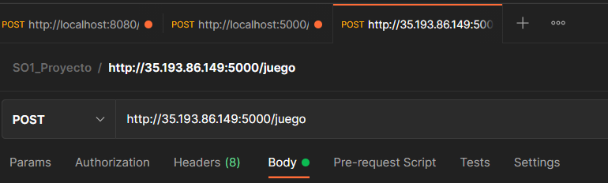

# USER MANUAL


Steps to use the application

#### :white_check_mark: Previous requirements

* API Consumer or traffic generator (Postman)
* Mongodb Compass (Or another mongodb administrator software)
* Traffic generator, for example Locust (advanced users)

<i> ** The following example will be explained using Postman </i>


1. Open Postman

2. Create a New Request 

3. In the direction bar insert the following direction: ```http://35.193.86.149:5000/juego```

4. Send a POST request with the body below: 


```json
{
    "game_id": "2",
    "players": "25"
}
```

5. The data will be stored in Mongodb database.

6. Open Mongodb Compass and see all the logs saved


<hr>

## Example with traffic generator

1. Write a traffic file in JSON, for example


2. In a python shell navigate to the directory where the Locust file is located
3. Type the following command
```sh
locust
```
you will have the following output


4. Go to ``` http://localhost:8089 ``` in your browser


5. Start the load test with the following data


6. The traffic will be generated and stored in the database.